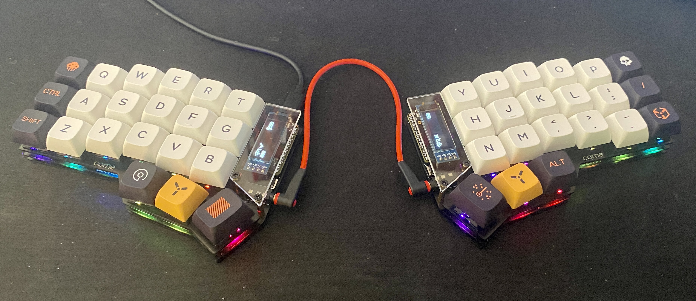

Corne Keyboard - CRKBD ZMK firmware with working RGB and OLEDs for Nice Nano V2 controllers.

Shield: Corne V3

Board: Nice!Nano V2

Keymap: Qwerty - 4 layer: default, raise, lower, adjust

OLED: Yes

RGB:  Yes

Bluetooth: Yes

USB: Yes 

